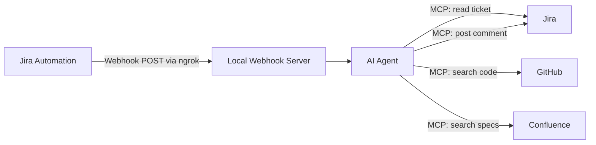

# Smart L3 — Design Document

## Overview

Smart L3 is an AI-agent-centric automation that assists L2 Product Support Engineers by analyzing PI (Parallel Investigation) tickets. When an L2 Engineer creates a PI ticket in Jira, a Jira automation fires a webhook to a lightweight local HTTP server. The server hands the payload to an AI agent powered by Amazon Bedrock (Claude via the Converse API), which then uses MCP server tools to read the Jira ticket, search GitHub code, search Confluence specs, analyze everything with its own LLM reasoning, and post a structured comment back on the Jira ticket.

The AI agent IS the core — there are no separate "Code Analyzer", "Spec Analyzer", or "Analysis Engine" services. The agent orchestrates everything through Bedrock's native tool-use loop: it sends messages to Bedrock with MCP tool definitions converted to Bedrock's `toolSpec` format, and when Bedrock responds with `stopReason: "tool_use"`, the agent executes the requested MCP tool and sends the result back. This continues until Bedrock responds with `stopReason: "end_turn"`, at which point the final analysis is extracted and posted to Jira.

This design targets the **2-day hackathon scope** (Requirements 1–5, 7). Production concerns are deferred.

### Key Design Decisions

1. **Node.js + TypeScript** — Fast to prototype, good async support, and the MCP SDK is TypeScript-native.
2. **Express.js** — Minimal webhook server. Receives the Jira webhook, hands off to the agent.
3. **Amazon Bedrock Converse API** — The agent calls Claude via Bedrock (`anthropic.claude-sonnet-4-20250514`) using `@aws-sdk/client-bedrock-runtime`. Bedrock handles authentication via standard AWS credentials (AWS CLI profile, environment variables, or IAM role) — no explicit API key needed.
4. **AI Agent with MCP Tools via Bedrock Tool Use** — The agent converts MCP tool definitions into Bedrock `toolSpec` format and uses Bedrock's native tool-use loop (`stopReason: "tool_use"` vs `"end_turn"`) to orchestrate all MCP calls. No separate typed service layers.
5. **Local hosting + ngrok** — The app runs on the developer's laptop. ngrok exposes the local webhook endpoint to the internet so Jira's automation can reach it.
6. **No database, no queue** — Stateless per-request. Each webhook triggers one agent run.
7. **Minimal custom code** — The webhook server and agent orchestration loop are the only custom code. Everything else is handled by MCP tool calls and Bedrock LLM reasoning.

---

## Architecture

The system is a thin webhook server that delegates all work to an AI agent. The agent connects to 3 MCP servers simultaneously — 2 stdio-based (Jira, Confluence) and 1 HTTP-based (GitHub) — collects all their tools into a unified list, and uses Bedrock's tool-use loop to orchestrate calls across all servers.



### How It Works

1. **Jira Automation** fires a webhook when an L2 creates a PI ticket.
2. **Local Webhook Server** (Express) receives the POST, extracts the ticket key from the payload.
3. **AI Agent** takes over:
   - On startup, connects to all 3 MCP servers simultaneously (2 stdio child processes + 1 HTTP remote).
   - Collects tool definitions from all 3 servers and combines them into one unified tool list for Bedrock.
   - Reads the full ticket details from Jira via MCP (summary, description, priority, labels, attachments).
   - Searches GitHub for relevant code files, commits, and PRs using ticket keywords/labels via MCP.
   - Searches Confluence for relevant spec pages using ticket keywords via MCP.
   - Analyzes all gathered context using Bedrock's LLM reasoning to produce root causes and solutions.
   - The tool-use loop routes each tool call to the correct MCP server based on which server owns that tool name.
   - Formats the analysis into an L2-friendly comment and posts it back on the Jira ticket via MCP.
   - Adds a `smart-l3-analyzed` label to the ticket via MCP.

### Local Deployment (Hackathon)

```
Developer's Laptop
├── Express server (port 3000)
├── AI Agent (orchestrator)
├── MCP Server connections:
│   ├── jira          (stdio — child process: npx @aashari/mcp-server-atlassian-jira)
│   ├── mcp-atlassian (stdio — child process: uvx mcp-atlassian)  [Confluence]
│   └── github        (HTTP — remote: https://api.githubcopilot.com/mcp/)

ngrok tunnel: https://xxxx.ngrok.io → localhost:3000
Jira Automation webhook → https://xxxx.ngrok.io/webhook/pi-ticket
```

- Run `ngrok http 3000` to expose the local server.
- Configure the Jira automation webhook URL to the ngrok tunnel URL.
- MCP server credentials are read from the existing config file (`~/.kiro/settings/mcp.json`).
- The 2 stdio servers (`jira`, `mcp-atlassian`) are spawned as child processes on startup.
- The HTTP server (`github`) is connected via SSE/Streamable HTTP transport on startup.

---

## Components and Interfaces

The codebase is intentionally small. Three files do the heavy lifting.

### 1. Webhook Server (`src/server.ts`)

Minimal Express server that receives the Jira webhook and kicks off the agent.

```typescript
// POST /webhook/pi-ticket
// - Extracts ticket key from payload
// - Calls agent.run(ticketKey) asynchronously (responds 202 immediately)
```

### 2. AI Agent (`src/agent.ts`)

The core of the system. Uses Amazon Bedrock Converse API with tool-use to orchestrate everything. Connects to all 3 MCP servers and routes tool calls to the correct server.

```typescript
// agent.run(ticketKey: string): Promise<void>
//
// On startup:
//   1. Connect to all 3 MCP servers via loadMcpClients():
//      - jira (stdio): spawns npx @aashari/mcp-server-atlassian-jira as child process
//      - mcp-atlassian (stdio): spawns uvx mcp-atlassian as child process (Confluence)
//      - github (HTTP): connects to https://api.githubcopilot.com/mcp/ via SSE transport
//   2. Collect tool definitions from all 3 servers into one combined list
//   3. Convert combined MCP tool definitions to Bedrock toolSpec format
//
// Tool-use loop:
//   1. Send messages to Bedrock Converse API with combined tool definitions and system prompt
//   2. If Bedrock responds with stopReason="tool_use":
//      - Extract the tool name and input from the response
//      - Route the call to the correct MCP server (based on tool-to-server mapping)
//      - Execute the tool via the owning MCP client
//      - Append the tool result to the conversation and send back to Bedrock
//   3. If Bedrock responds with stopReason="end_turn":
//      - Extract the final analysis text from the response
//      - Format and post the comment to Jira
//   4. Loop until stopReason="end_turn"
```

### 3. MCP Client Setup (`src/mcp.ts`)

Initializes connections to ALL 3 MCP servers simultaneously. The agent connects to 3 MCP servers with 2 different transport types:

- **stdio-based** (spawned as child processes): `jira` and `mcp-atlassian` (Confluence)
- **HTTP-based** (remote connection): `github`

The config file (`~/.kiro/settings/mcp.json`) determines which transport to use per server:
- If the entry has a `command` field → stdio transport (`StdioClientTransport`), spawned as a child process with the given `command`, `args`, and `env`.
- If the entry has a `url` field (and optionally `type: "http"`) → HTTP transport (`SSEClientTransport` or `StreamableHTTPClientTransport`), connecting to the remote URL with the given `headers`.

After connecting to all 3 servers, tool definitions (name, description, inputSchema) are collected from each server and combined into a single unified tool list. The agent uses this combined list for Bedrock's `toolSpec` definitions. When Bedrock requests a tool call, the agent routes it to the correct MCP server based on which server originally provided that tool name.

```typescript
// loadMcpClients(configPath: string): Promise<McpClients>
//
// Reads ~/.kiro/settings/mcp.json
// For each enabled server entry:
//   - If entry has "command" → create StdioClientTransport, spawn child process
//   - If entry has "url" → create SSEClientTransport (or StreamableHTTPClientTransport), connect to remote
// Returns connected MCP clients keyed by server name: { jira, "mcp-atlassian", github }
//
// collectAllTools(clients: McpClients): ToolDefinition[]
//
// Calls client.listTools() on each connected MCP server
// Combines all tool definitions into a single list
// Each tool definition tracks which server it belongs to (for routing)
//
// callTool(clients: McpClients, toolName: string, args: any): Promise<any>
//
// Looks up which MCP server owns the given tool name
// Routes the call to the correct MCP client
```

### 4. Prompt Template (`src/prompt.ts`)

The system prompt and analysis prompt template for the AI agent.

```typescript
// buildSystemPrompt(): string
// - Defines the agent's role, available MCP tools, and behavior rules
//
// buildAnalysisPrompt(ticketDetails, codeContext, specContext): string
// - Structures all gathered context into a single analysis prompt
// - Instructs the LLM to produce: Issue Summary, Root Causes, Solutions, References
// - Instructs the LLM to write in plain language for L2 engineers
```

---

## Data Models

No typed data models. The webhook server extracts the ticket key (a plain string like `"PI-1234"`) from the incoming JSON payload and passes it directly to the AI agent. From there, the agent works entirely with raw MCP tool responses and Bedrock's LLM reasoning — no intermediate types, no structured objects, no transformation layers.

Configuration is read from environment variables:
- `AWS_REGION` — AWS region for Bedrock (e.g. `us-east-1`)
- `BEDROCK_MODEL_ID` — Bedrock model identifier (e.g. `anthropic.claude-sonnet-4-20250514`)
- `PORT` — Webhook server port (default `3000`)
- `MCP_CONFIG_PATH` — Path to MCP server config file (default `~/.kiro/settings/mcp.json`)

AWS credentials are resolved via the standard AWS credential chain (AWS CLI profile, environment variables, or IAM role). No explicit API key is needed.


---

## Correctness Properties

*A property is a characteristic or behavior that should hold true across all valid executions of a system — essentially, a formal statement about what the system should do. Properties serve as the bridge between human-readable specifications and machine-verifiable correctness guarantees.*

### Property 1: Webhook payload yields correct ticket key

*For any* valid Jira webhook payload containing an issue object with a `key` field, the webhook server should extract and return the correct ticket key string matching the original payload value.

**Validates: Requirements 1.2**

### 🔮 FUTURE — Property 2: Malformed or unauthorized payloads are rejected

> Deferred for post-hackathon. The hackathon prototype assumes valid webhook payloads.

*For any* webhook request that is missing the `issue.key` field, has a malformed body, or carries an invalid/missing authorization secret, the webhook server should reject the request with an appropriate HTTP error status (400 or 401) and never trigger the AI agent.

**Validates: Requirements 1.3**

### 🔮 FUTURE — Property 3: Short descriptions trigger skip

> Deferred for post-hackathon. The hackathon prototype assumes tickets have sufficient descriptions.

*For any* ticket description that is fewer than 20 characters in length, the AI agent should skip analysis and signal that a "more details needed" comment should be posted on the ticket.

**Validates: Requirements 1.5**

### 🔮 FUTURE — Property 4: Retrieval limits are enforced

> Deferred for post-hackathon. The hackathon prototype relies on MCP tool defaults for result limits.

*For any* list of candidate code files returned per repository, the count should not exceed 20. *For any* list of candidate Confluence pages returned per ticket, the count should not exceed 10.

**Validates: Requirements 2.3, 3.3**

### Property 5: Analysis prompt includes all provided context

*For any* combination of ticket details (summary, description, labels), code snippets, and spec content provided to the prompt builder, the resulting prompt string should contain all of the provided ticket details, all code snippet contents, and all spec page contents.

**Validates: Requirements 4.1**

### Property 6: Formatted comment contains all required section headers

*For any* analysis output produced by the agent, the formatted Jira comment string should contain the section headers "Issue Summary", "Potential Root Cause(s)", "Recommended Solutions", and "References".

**Validates: Requirements 5.2**

### 🔮 FUTURE — Property 7: Retry mechanism respects max attempts and exponential backoff

> Deferred for post-hackathon. The hackathon prototype assumes successful API calls (happy path).

*For any* operation that fails repeatedly, the retry utility should attempt the operation exactly 3 times, with delays following exponential backoff (1s, 2s, 4s), and throw the final error after all attempts are exhausted.

**Validates: Requirements 1.4, 5.4**

---

## Error Handling

For the hackathon prototype, we assume the happy path: valid webhooks, sufficient ticket descriptions, and successful API calls. The agent does not implement retries, validation guards, or graceful degradation.

> ### 🔮 FUTURE — Production Error Handling
>
> The following error handling strategy is deferred for post-hackathon production readiness.
>
> | Scenario | Handling |
> |---|---|
> | Malformed/unauthorized webhook | Webhook server returns HTTP 400/401, agent is never invoked |
> | Ticket description < 20 chars | Agent posts "need more details" comment via Jira MCP, stops |
> | GitHub MCP call fails | Agent logs the error, continues analysis with spec-only context |
> | Confluence MCP call fails | Agent logs the error, continues analysis with code-only context |
> | Both GitHub and Confluence fail | Agent posts a comment stating it could not gather context, recommends manual L3 investigation |
> | LLM analysis fails | Agent retries once. On second failure, posts a comment stating analysis could not be completed |
> | Jira comment post fails | Agent retries up to 3 times with exponential backoff. After exhaustion, logs the failure |
> | Jira label update fails | Agent logs warning, does not retry (non-critical) |
> | Unhandled exception | Caught at webhook server level, logs stack trace, returns HTTP 500 |
>
> #### Retry Utility
>
> All retries use exponential backoff: `delay = 1000ms * 2^(attempt - 1)`.
>
> ```typescript
> async function withRetry<T>(
>   fn: () => Promise<T>,
>   maxAttempts: number = 3,
>   baseDelay: number = 1000
> ): Promise<T> {
>   for (let attempt = 1; attempt <= maxAttempts; attempt++) {
>     try {
>       return await fn();
>     } catch (error) {
>       if (attempt === maxAttempts) throw error;
>       await sleep(baseDelay * Math.pow(2, attempt - 1));
>     }
>   }
>   throw new Error('Unreachable');
> }
> ```

---

## Testing Strategy

### Dual Testing Approach

Smart L3 uses both unit tests and property-based tests. For the hackathon, the testable surface is focused on the happy-path properties:
- The webhook server (ticket key extraction)
- The prompt builder (context assembly)
- The comment formatter (section headers)

**Unit tests** (Jest): Specific examples and integration points with mocked MCP clients.
**Property-based tests** (fast-check): Universal properties across randomly generated inputs, minimum 100 iterations each.

### Property-Based Testing Configuration

- **Library**: `fast-check` (TypeScript-native, integrates with Jest)
- **Minimum iterations**: 100 per property test
- **Tag format**: Each test is annotated with a comment referencing the design property:
  ```
  // Feature: smart-l3, Property {number}: {property_text}
  ```
- Each correctness property is implemented by a single property-based test.

### Unit Test Focus Areas

- Webhook extraction: Specific examples of valid webhook payloads
- End-to-end integration: Mock all MCP clients, verify full happy-path pipeline from webhook to comment post

### Property Test Mapping (Hackathon Scope)

| Property | Test Description |
|---|---|
| Property 1 | Generate random valid webhook payloads → verify correct ticket key extracted |
| Property 5 | Generate random ticket details + code + specs → verify prompt contains all content |
| Property 6 | Generate random analysis output strings → verify formatted comment has all section headers |

> ### 🔮 FUTURE — Additional Property Tests
>
> The following property tests are deferred for post-hackathon production readiness.
>
> | Property | Test Description |
> |---|---|
> | Property 2 | Generate random payloads with missing fields or invalid auth → verify rejection |
> | Property 3 | Generate random strings of length 0–19 → verify skip signal triggered |
> | Property 4 | Generate random file/page lists of varying sizes → verify limits (20 files, 10 pages) enforced |
> | Property 7 | Generate random failing operations → verify exactly 3 attempts with correct backoff delays |

### Test File Structure

```
src/
  __tests__/
    server.test.ts          # Unit + Property tests for webhook server (Property 1)
    prompt.test.ts          # Property tests for prompt builder (Property 5)
    comment.test.ts         # Property tests for comment formatter (Property 6)
    integration.test.ts     # End-to-end happy-path test with all MCP clients mocked
```
